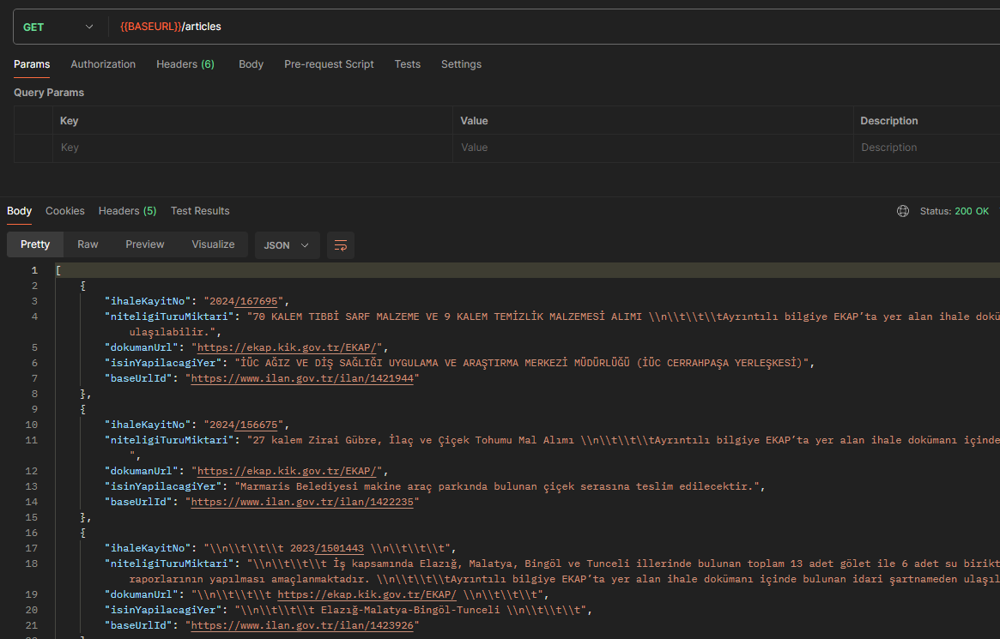
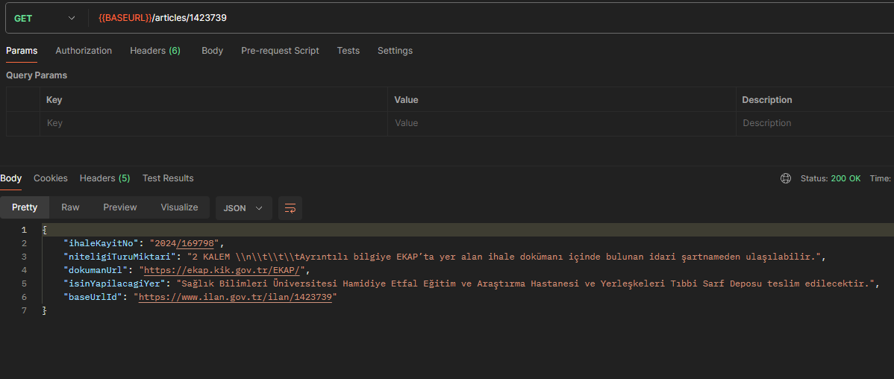
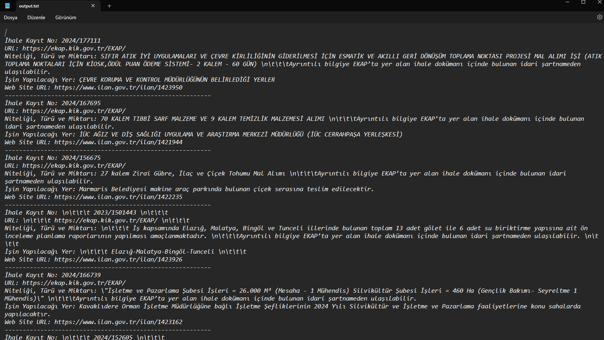

# Crawler Service and Controller Documentation

`CrawlerServiceImpl` sınıfı, `CrawlerService` arayüzünden türetilmiş bir servis kullanmaktadır. Bu servis, www.ilan.gov.tr adresindeki ihale duyuruları sayfasından veri çekme işlevselliğine sahiptir. İlk 10 sayfadaki ilanlardan elde edilen verileri liste olarak döndüren `inquireResults` ve belirli bir ilan ID'sine göre ilan detaylarını getiren `inquireResultById` metodlarına sahiptir.

## Crawler Service Metodları

### `inquireResults`

Metod, ilk 10 sayfadaki ilanlardan elde edilen verileri liste olarak döndürür.

### `inquireResultById`

Belirli bir ilan ID'sine göre ilan detaylarını getiren metod.

`Controller` sınıfı, bu servisi kullanarak HTTP GET isteklerine cevap verir. İlgili API endpoint'leri şu şekildedir:

- **/articles** (GET): Bu endpoint, tüm ilanların listesini getirir. (?page=5) RequestParam ile kaç sayfayı tarayacağını belirtebilirsiniz
- 

##

- **/articles/{id}** (GET): Bu endpoint, belirli bir ilan ID'sine göre ilan detaylarını getirir.

Bu controller, istemcilere JSON formatında cevaplar döndürür. `/articles` endpoint'i tüm ilanları listeleyip, `/articles/{id}` endpoint'i ise belirli bir ilanın detaylarını gösterir.

Aynı zamanda bu veriler output.txt içerisinde tutulur ;

